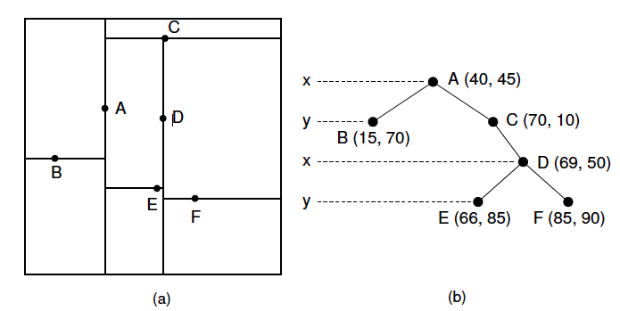
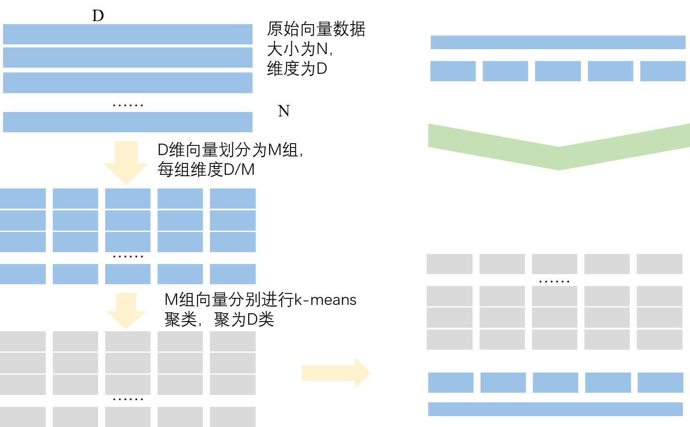

LLM的模型的爆火，意外带动了向量数据库的热度。之前名不见经传的一些初创公司也突然备受追捧。最近在分析端侧LLM场景的时候也分析了相关的一些向量数据库的相关知识。

# GPT的缺陷
chatgpt在对话过程中表现出的能力包括了一定的上下文检索能力。但这个能力是基于LLM本身的上下文理解能力完成的，但受限于多数模型是基于kv cache结构的记忆历史对话信息的，kv cache size是有限的，在长程记忆上就天然存在一些缺陷。另一方面，在跨对话的场景下，这些上下文信息也不能使用。如果在端侧作为一个数字助理的场景来看，这显然是不合格的。

不同模型对于 token 的限制也不同，gpt-4 是 32K tokens 的限制，而目前最大的 token 限制是 Claude 模型的 100K，这意味可以输入大约 75000 字的上下文给 GPT，这也意味着 GPT 直接理解一部《哈利波特》的所有内容并回答相关问题。

这时候就可能觉得，那我把上下文信息一起发给LLM模型不就可以了。这就到了向量数据库的场景范畴了。在处理用户输入的时候，先去通过向量查找得到一些相关信息，一起输入给LLM模型，这样就可以正确回答相关信息了。

# ANN Search

向量数据库说起来并不是一个新鲜的技术了，在统计机器学习时代，做KNN算法的时候就已经在研究相关的技术了。这里就简要的介绍一下原理和算法。

ANN搜索（Approximate nearest neighbor）, 本质上是在很多稠密向量中，迅速找到目标点的临近点，并认为这认为是相似的节点，主要用于图像检索、高维检索。这里隐含了一个假设，映射在同一向量空间且距离相近的点，具有相似的语义特征，距离越近越相关，反之关系越远。

当前 ANN 搜索的方法大都是对空间进行切分，可以迅速找到子空间，并与子空间的数据进行计算。方法主要有基于树的方法、哈希方法、矢量量化、基于图的方法。

## 基于树的方法
基于树的方法最经典的就是KD树了。

**构建**
KD树构建的过程就是迭代二分空间的过程
经典算法：
选择方差最大的维度,计算中位数点，作为划分点，分为左右子树，迭代上述过程, 直到空间上的点小于阈值

**检索**
因为ANN这个任务并不像关系数据库中那样需要精准的结果，而是得到其中Top-K的候选结果返回。
KD树的检索过程其实就是一个二叉树的回溯搜索过程：

1. 根据目标p的坐标和kd树的结点向下进行搜索，如果树的结点root是以数据集的维度d以来切分的，那么如果p的维度d坐标值小于root，则走左子结点，否则走右子结点。
2. 到达叶子结点时，将其标记为已访问。如果S中不足k个点，则将该结点加入到S中；否则如果S不空且当前结点与p点的距离小于S中最长的距离，则用当前结点替换S中离p最远的点。
3. 如果当前结点不是根节点，执行（a）；否则，结束算法。 
  a.  回退到当前结点的父结点，此时的结点为当前结点（回退之后的结点）。将当前结点标记为已访问，执行（b）和（c）；如果当前结点已经被访过，再次执行（a）。 
  b. 如果此时S中不足k个点，则将当前结点加入到S中；如果S中已有k个点，且当前结点与p点的距离小于S中最长距离，则用当前结点替换S中距离最远的点。 
  c. 计算p点和当前结点切分线的距离。如果该距离大于等于S中距离p最远的距离并且S中已有k个点，执行步骤3；如果该距离小于S中最远的距离或S中没有k个点，从当前结点的另一子节点开始执行步骤1；如果当前结点没有另一子结点，执行步骤3。

## LSH
LSH即 local sensitive hash，局部敏感哈希。不同于sha256、MD5这种避免碰撞的函数，这里我们选取hash函数的时候希望语义相近的向量可以映射到同一个桶里。这里有一个前提在的：
> 原始数据空间中的两个相邻数据点通过相同的映射或投影变换（projection）后，这两个数据点在新的数据空间中仍然相邻的概率很大，而不相邻的数据点被映射到同一个桶的概率很小。

**构建**
1. 选取一组的LSH hash functions；
2. 将所有数据经过 LSH hash function 哈希到相应的hash码，所有hash数据构成了一个hash table；

**检索**

1. 将查询数据经过LSH hash function哈希得到相应的编码；
2. 通过hamming 距离计算query数据与底库数据的距离，返回最近邻的数据

当然也有其他的实现方案，这里不一一列举了。

## 量化
LSH这一类算法给了一个很好的加速方案，既然在原始向量空间内存在计算慢的问题，那么把向量数据映射到一个新的空间是不是就可以加速了。量化的算法就是这么想的，float型数据内存占用大，计算慢，那映射到整型数据就快了。

### PQ量化
PQ量化，即乘积量化，这里的乘积指的是笛卡尔积。
如图所示。我们有一个向量库，里面有N个向量，每个向量D维。简要介绍一下算法原理：

PQ 量化一般分为三个步骤：

**Train**

1. 向量切分：将D维向量切分成M组子向量，每个子向量 $\frac{D}{M}$ 维。
2. 聚类：分别在每一组子向量集合内，做Kmeans聚类，在每个子向量空间中，产生K个聚类中心。
   - 每个聚类中心就是一个 $\frac{D}{M}$ 维子向量，由一个id来表示，叫做clusterid。
   - 一个子空间中所有的clusterid，构造了一个属于当前子空间的codebook。对于当前向量库，就有M个codebook。
   - 这M个codebook所能表示的样本量级就是 $K^M$，也就是 M个codebook的笛卡尔积。

**建库** 
对于子向量空间中的N个子向量样本，在完成Kmeans聚类之后，用这个聚类中心的clusterid来代表这个子向量。这就是构建底库的过程。

原本我们的向量库的大小为 $N\times D\times 32bit$，压缩后，clusterid按照8bit来算的话，那就是 $N\times M * 8bit $，相比压缩前少了很多。

**查找**
这里查找的过程存在两种方式：SDC和ADC

**SDC**
S=symmetric，对称的。如图symmetric case。图中x就是query检索向量，y就是向量库里面的向量(注意，y已经是量化过了的，就是上文中说的那个用数字id替代向量)。那么如何计算x与y的距离呢？
- 首先，计算q(x)，拿到x对应的聚类中心；同样的，计算q(y)，拿到y对应的聚类中心。
- q(x)和q(y)就是两个完整的子向量，我们计算这两个向量的距离，便是当前子空间下的距离。

为什么名字叫symmetric呢？因为他俩都是用对应的聚类中心来计算距离，所以是对称的。
优点:
- 两两聚类中心之间的距离，可以离线就计算好，在线直接查表，提升了在线query的效率。

缺点：
- 误差也比ADC来的大，因为有x和q(x)，y和q(y)两个量化误差。

**ADC**
A=asymmetric，不对称的。上文中讲了对称是因为SDC都用了对应的聚类中心。那么ADC，就只有向量库中的y使用了聚类中心，而query向量x没有。那么，计算距离的时候，计算的就是x和q(y)的距离了。ADC的精确度更高，因为只有y和q(y)这一个量化误差；当然必须要在线计算(x是用户请求带过来的)，计算速度不如SDC。

**计算过程**

将每一个子空间下的所有距离的平方相加再开根号，就是最终的X跟Y的距离了(就是使用每个子空间的向量距离进行了一次欧氏距离计算)。

### SQ量化

## IVF类方法
上面讲的量化算法，仅仅并没有解决全库计算的问题，虽然数据上做了压缩，如果数据量一大，计算量还是很大。如果可以只计算最相关的一部分，是不是就可以进一步减少了呢。这就是IVF算法的思路。

## 基于图的方法

### NSW

### HNSW
# 部署加速方案

