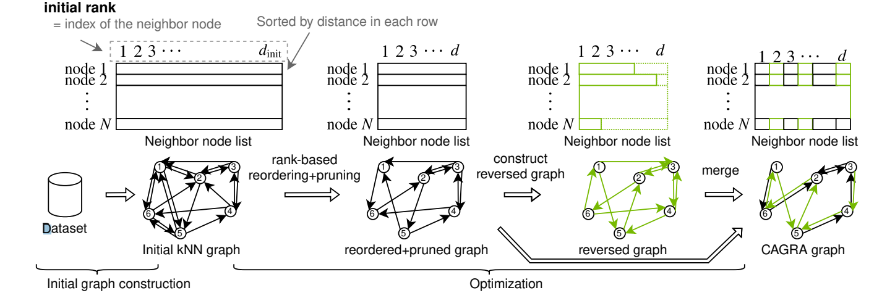
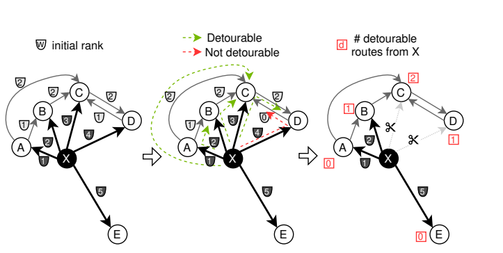
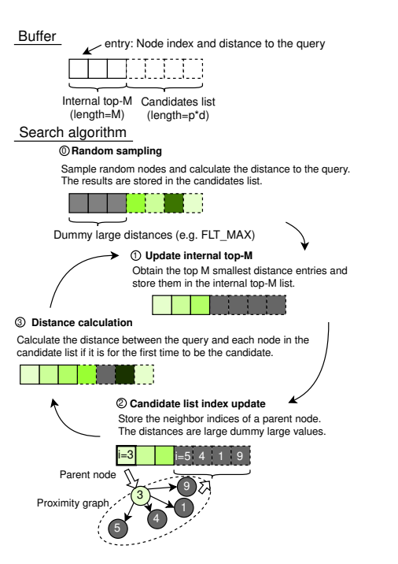

[CAGRA](https://docs.rapids.ai/api/raft/nightly/pylibraft_api/neighbors/#cagra) 是 N社在RAFT项目中 最新的 ANN 向量索引。这是一种高性能的、 GPU 加速的、基于图的方法，尤其是针对**小批量情况进行了优化**，其中每次查找只包含一个或几个查询向量。

与其他像HNSW、SONG等这类基于图的方法相似，CAGRA在索引训练阶段构建了一个经过优化的 k-最近邻（k-NN）图。这个图具备多种优良特性，能够在保持合理召回率的同时实现高效的搜索。与NSW、HNSW算法不同的是，CARGA算法是单层的图，为了适用GPU计算加速，在构建和查询阶段做了特殊的优化。

```c++
using namespace raft::neighbors;
// use default index parameters based on shape of the dataset
ivf_pq::index_params build_params =   ivf_pq::index_params::from_dataset(dataset);
ivf_pq::search_params search_params;
auto knn_graph      = raft::make_host_matrix<IdxT, IdxT>(dataset.extent(0), 128);

// create knn graph
cagra::build_knn_graph(res, dataset, knn_graph.view(), 2, build_params, search_params);
auto optimized_gaph = raft::make_host_matrix<IdxT, IdxT>(dataset.extent(0), 64);
cagra::optimize(res, dataset, knn_graph.view(), optimized_graph.view());
// Construct an index from dataset and optimized knn_graph

auto index = cagra::index<T, IdxT>(res, build_params.metric(), dataset,
                                   optimized_graph.view());
```

CAGRA构建的图有几个不同之处：
- 每个节点有固定的出度
- 构建的图是一个有向图
- 不同于HNSW，CAGRA构建的图是单层的

## 构建

为了满足GPU加速的要求，并行度要高、且召回率也要准确，构建的图得满足：
1. **任意节点间的遍历能力**：这是为了确保图中的所有节点都是相互可达的。如果一个图中存在某些节点无法从其他节点访问，那么这些孤立的节点在搜索过程中将永远不会被考虑，这可能导致搜索结果的不完整或不准确。确保所有节点都是相互可达的，有助于提高搜索算法的覆盖率和准确性。
    
2. **指定遍历次数内的节点访问数量**：这个指标用来衡量从任一节点出发，在有限的步骤内能够探索到的节点的多样性和数量。在ANNS中，通常希望在较少的遍历步骤内能够访问到更多的节点，这样可以更快地找到可能的最近邻。如果一个节点在几步之内能够访问到很多其他节点，那么搜索算法的效率和召回率（即找到真正最近邻的概率）可能会更高。

所以就涉及到了图构建过程中的优化目标：
- **强连通分量（Strong Connected Components, CC）** 的个数
	通过计算图中的强连通分量数量来评估图中任意节点是否能够到达其他任意节点。强连通分量是图中的子图，其中每个节点都可以直接或间接地到达子图中的任何其他节点。
	> A smaller number of strong CC are preferred because a larger number of CC can lead to more unreachable nodes starting from a search start node.
	
- **平均 2 跳节点数（Average 2-hop Node Count）**：
	这个指标衡量的是从任一节点在两次遍历内能够到达的节点数量，用以评估在特定搜索迭代步骤中可以探索的节点数量。

### 构建过程



CAGRA算法的构建训练过程，先初始化一个knn graph，然后优化其中的边关系。
1. 初始knn-graph创建：比较简单，这里实际上可以理论上依赖任何一种已有的算法，但在实现上选了IVF-PQ、和NN-Descent算法。这里就不过多展开了
	> 步骤一结束后，每个节点都有k个邻居节点，并且通常按距离排序
2. 基于**rank**的重排序：这里每个节点出边按照初始rank重新排序，并且过滤掉一些边
	
	 - 左侧：来自节点X及其他相关边的初始排名。
	 - 中间：可能的两跳路径（XAB、XBC、XCD、XAC、XDC），根据方程3被分类为可绕路和不可绕路的。我们使用排名代替距离。
		 $$
		 (eX→Z, eZ→Y ) s.t. \max(wX→Z, wZ→Y ) < wX→Y 
	    $$
		 >  直接边就不是最优路径，可以被视为可绕路的

	 - 右侧：连接到节点X的每个节点的可绕路路径数量。根据可绕路路径数量，从列表末尾开始丢弃边。
1. **构建反向图**
	同样的思路构建反向图。 
4. 融合两张图 
## 查找
之前的HNSW一类算法之所以不能满足GPU计算主要原因就是并行度不够，很难去发挥GPU多线程计算的优势。CAGRA不同之处在于在构图的时候尽可能保证了任意两点的可达性，在查找的时候放弃了按照最近路径找到目标节点的优化思路，而是通过提高吞吐量来尽可能覆盖尽可能多的点来提高召回率和GPU利用率。

这里需要特别提一点就是这里的buffer。其实是两部分的，前半部分top-M的，我猜测是有序的，后半部是候选访问区，不必一定保证有序。



计算过程：
1. 随机选取E个节点，计算他们与 query 的距离，并存在 candidate buffer 中
2. 在 top-M buffer（这里应该是上一轮的结果，初始阶段为空） 和 candidate buffer 中选取 top M 个结果存储在 Top-M buffer中  
3. 在Top-M buffer中选取一个还没有被 traverse 的离 query 最近的节点  
4. 选取与 Step 3 中选择的节点近邻的E个没有访问的节点，并计算他们与query的距离，然后存储在 Candidate buffer 中
一直计算到收敛（topM buffer全部是已访问状态）


参考：
1. https://github.dev/facebookresearch/faiss
2. https://arxiv.org/pdf/2308.15136
3. kimi_chat
