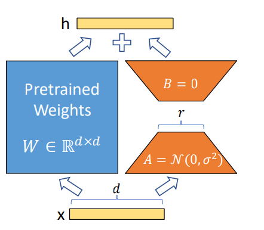

- 论文链接：[link](https://arxiv.org/abs/2106.09685)
- code: [github](https://github.com/microsoft/LoRA)

## 什么是LoRA
LoRA，英文全称**L**ow-**R**ank **A**daptation of Large Language Models，直译为大语言模型的低阶适应，是一种PEFT（参数高效性微调方法），这是微软的研究人员为了解决大语言模型微调而开发的一项技术。当然除了LoRA，参数高效性微调方法中实现最简单的方法还是Prompt tuning，固定模型前馈层参数，仅仅更新部分embedding参数即可实现低成本微调大模型，建议可从Prompt tuning开始学起。

LoRA的基本原理是冻结预训练好的模型权重参数，在冻结原模型参数的情况下，通过往模型中加入额外的网络层，并只训练这些新增的网络层参数。由于这些新增参数数量较少，这样不仅 finetune 的成本显著下降，还能获得和全模型微调类似的效果

## why works

### 问题描述
给定一个预训练模型$P_{\Phi}(y|x)$ , fine tuning 的过程可以表示为
$$
\max_{\Phi}\sum_{x,y\in Z} \sum_{t=1}^{|y|} {log(P_{\Phi}(y_t|x,y<t))}
$$
对于fine tuning前后参数变化，其实就是
$$
\Phi = \Phi_0+\Delta \Phi
$$
这种方案有一个缺点，对不同的下游任务，$\Delta \Phi$ 需要训练，而且$\Delta \Phi$ 的参数维度跟$\Phi$一样大，如果是GPT-3的话参数量要175B了。
如果$\Delta \Phi$ 够小，只调整$\Delta \Phi$ 这部分参数是不是就可以减少资源使用了。所以问题可以表示为
$$
\max_{\Phi}\sum_{x,y\in Z} \sum_{t=1}^{|y|} {log(P_{\Phi_0+\Delta \Phi(\Theta)}(y_t|x,y<t))}
$$

### LoRA
对于NN模型来说，权重都是满秩的。但是对于特定任务来说，
> 预训练的语言模型具有较低的“固有维度”，尽管随机投影到较小的子空间，但仍然可以有效地学习
> the pre-trained language models have a low “instrisic dimension” and can still learn efficiently despite a random projection to a smaller subspace

基于此，假设与训练的LLM也具有这个性质，finetuning 的过程中也有一个低秩的性质。

对于权重  $W_0 \in \mathbb{R}^{d\times k}$ ,权重更新可以表示为 $W_0+\Delta W$ ,考虑低秩分解，即为$W_0+\Delta W = W_0+BA$ , 其中$B \in \mathbb{R}^{d\times r}$, $A\in \mathbb{R}^{r\times k}$ , $r << \min(d,k)$
则：
$$
h=W_0x+\Delta Wx=W_0x+BAx
$$

## 实现
### huggingface
- code [link](https://github.com/huggingface/peft/blob/main/src/peft/tuners/lora.py)

[梯度视角下的lora](https://spaces.ac.cn/archives/9590)
