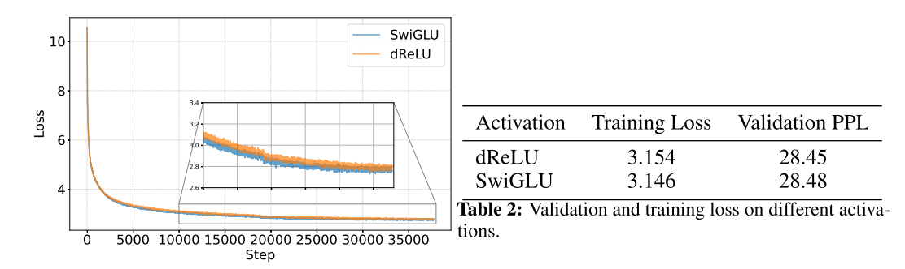
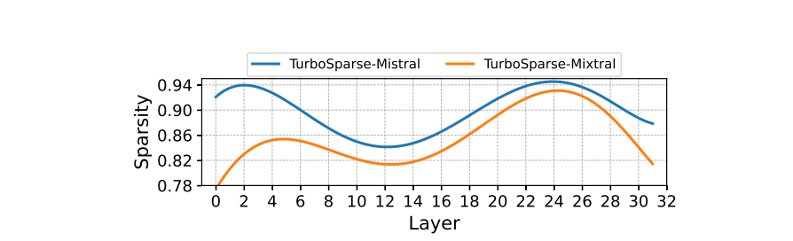

## 关于llama稀疏性的观察
llama原始模型的FFN计算过程为：

$$
f(x) = \text{silu}(xW_{Gate}) \odot xW_{UP} \times W_{Down}
$$

```python
class FeedForward(nn.Module):
    def forward(self, x):
        return self.w2(F.silu(self.w1(x)) * self.w3(x))
```

| Model               | Sparisty |
| ------------------- | -------- |
| Llama-2-7B          | 40%      |
| ReLULlama-7B        | 67%      |
| ShiftedReLULlama-7B | 71%      |

论文统计首层transformer block FFN层的稀疏性质，原生FFN的稀疏性仅有40%，激活函数由silu替换为Relu后可以达到67%，而ShiftedReLU可进一步提高到71%。
从FFN层的计算上来看，表面上是Gate部分作为门控控制了计算的稀疏性，**实际上Up、Gate共同控制了计算的稀疏性**，所以很自然的就引出了**drelu**的方案

$$
\text{Combined dReLU} (x) := max(0, xW_{gate} ) \odot max(0, xW_{up} )
$$



从训练过程上来看，替换以后收敛性没有影响，结果的评价指标上也没有太大影响。

下一步就是进一步评价下修改以后得稀疏度了。这里没有直接用两个mask的交集，而是按照topk的方法做了评测

$$
\text{Mask}(x) := Top_k(|\text{Combined}(x)|) 
$$

$$
		\text{Gated-MLP}(x) := (\text{Combined}(x) ∗ \text{Mask}(x))W_{down}
$$


显然效果显著。不影响模型表现的情况下，稀疏到达到了80%，而牺牲一定精度的条件下可以到达**90%**

## Sparsity of Sparsifi ed Models

