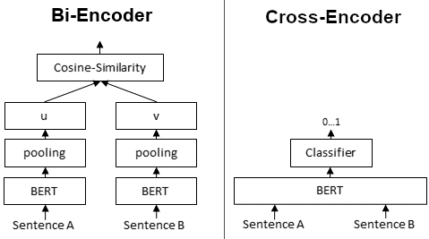

Bi-encoder和Cross-encoder是在自然语言理解任务模型的两种不同方法，在信息检索和相似性搜索二者的使用更为广泛。在LLM大火的今天，RAG的pipe line中这两个模块作为提升检索精度的模块更是备受瞩目。

## Bi-encoder：
- 架构：在Bi-encoder模型中，有两个**独立**的编码器——一个用于编码输入的查询，另一个用于编码候选文档。这些编码器独立工作，为查询和每个文档生成嵌入表示。
- 训练：在训练期间，模型被训练以最大化查询与相关文档之间的相似性，同时最小化查询与不相关文档之间的相似性。训练通常使用对比损失函数进行。
- 评分：在推理时，模型独立计算查询与每个文档之间的相似性得分。相似性得分最高的文档被认为是最相关的。
使用案例：Bi-encoder通常用于文档检索或排名是主要目标的任务，如搜索引擎或推荐系统。

双编码器为给定句子生成句子嵌入。我们**独立**地将句子A和句子B传递给BERT，分别得到句子嵌入u和v。然后可以使用余弦相似度来比较这些句子嵌入。

## Cross-encoder
架构：在Cross-encoder模型中，查询和文档一起在**单个**编码器中处理。这意味着模型将查询和文档作为输入，并产生联合表示。
训练：与Bi-encoder类似，Cross-encoder被训练以最大化相关查询-文档对之间的相似性。但是，由于它们同时处理查询和文档，因此它们捕获了两者之间的交互。
评分：Cross-encoder为每个查询-文档对生成单一的相似性得分，考虑了查询和文档嵌入之间的交互。得分最高的文档被认为是最相关的。
使用案例：当捕获查询和文档之间的交互对于您的任务至关重要时，Cross-encoder非常有用，例如在理解查询和文档之间的上下文或关系很重要的任务中。

## 使用哪个：

Bi-encoder：当您拥有大规模数据集和计算资源时，使用Bi-encoder。由于相似性得分可以独立计算，它们在推理期间通常更快。它们适用于捕获查询和文档之间复杂交互不太关键的任务。

Cross-encoder：当捕获查询和文档之间的交互对于您的任务至关重要时，请选择Cross-encoder。它们在计算上更为密集，但可以在理解查询和文档之间的上下文或关系至关重要的场景中提供更好的性能。

最终，在Bi-encoder和Cross-encoder之间的选择取决于您的自然语言理解任务的具体要求以及可用的计算资源。