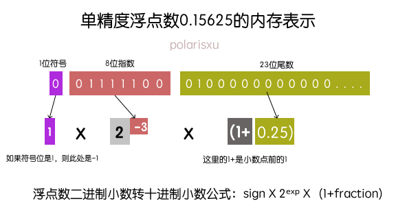
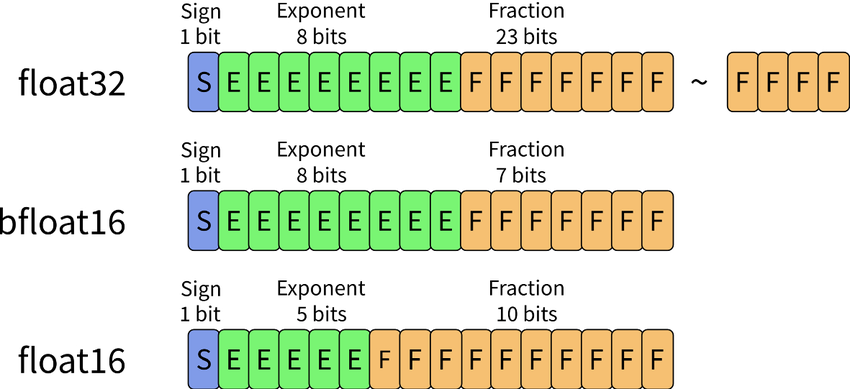

主要记录了论文Who Says Elephants Can't Run: Bringing Large Scale MoE Models into Cloud Scale Production中关于反量化的快速操作。

# 背景
NN模型通常为了降低RAM、FLASH占用，提高计算吞吐率，会引入量化操作。比如INT8、INT4、INT3等等。如果是weight only的量化方法情况，输入的部分还是浮点，在GPU、NPU、arm上float16用的比较多。这样一来，就需要在计算的时候，需要把权重反量化到浮点再进行计算。

论文在实验中发现，使用原生的native Int8ToFloat16做数值类型转换，性能并不符合预期。于是决定，将native Int8ToFloat16（吞吐低，底层应该是走 PTX cvt指令->SASS，关于ARM上计算，这里回头查一下）替换成一系列高吞吐的ALU和FP16运算指令，来巧妙地完成Int8->Float16的数值转换。

## INT8 -> Float16
- 【观察一】 对于任意 FP16 数 X，其中 1024 ≤ X <2048, 1024 将准确地表示在指数位，而 int(X − 1024) 部分将直接存储在尾数中（二进制level原封不动地存储）。
- 【观察二】对于任何整数 0 ≤ Y < 1024，我们可以构造 Y + 1024 的 FP16 表示，将指数设置为 1024 并存储 Y在 FP16 尾数中。

[浮点表示](https://evanw.github.io/float-toy/)

首先，回忆一下浮点的表示方法。下图表示了float32的表示。


很明显可以看出来，右侧尾数表示的范围与左侧指数的表示范围是强相关的，左边指数范围越小，那么精度越高；反之，指数越大，精度越低。下面我们看下float16。



我们先忽略符号位部分，中间5bit表示指数，右边10bit表示小数。回到转10进制的表示，
$$
 sign \times 2^{exp-15} \times (1+\frac{frac}{1024})
$$

其中fraction表示尾数部分的10进制数值，公式中之所以是(fraction/1024)，是因为FP16尾数部分是10位，而2^10=1024。
来看一个FP16二进制转实数的列子，比如`0b0110010000000011`这个FP16，其中组成为：

```text
0b 0 11001 0000000011
# 符号位：0
# 指数位：11001 -> 25 -> 25 - 15 = 10, 2^10=1024
# 尾数部分：0000000011 -> fraction为3（尾数部分的10进制数值）
```

转换为实数表达为：

```text
1 * 2^10 * (1 + 3/1024) = 1027 = 1024 + 3 <-> 2^10 * 1 + 2^10 * 3/1024 
```
观察一，是**针对FP16数值**而言的，它描述的其实是，FP16中落在$[1024, 2048)$ 范围中的数值，**在16个bit位上的分布规律**。如果转float32。同样道理算一下就可以。

现在从观察一可以得到一个结论：
$[1024, 2048)$ 范围内的float16整数x，在尾数部分的值恰好等于 x-1024
现在结合观察二，就得到量化后int4数值速转float16方法。
```
x = 0x6400 | (x &0b1111)
x = x - 1024
```

上面可以看出，这个操作仅支持正数，那么int8是有符号的怎么处理的呢？

> 量化存储的int值是加上了128转为u8，在反量化时需要减去这个128即可


code: https://github.com/Wanger-SJTU/recipes/tree/master/fast_dequant
**参考链接：**
1. https://zhuanlan.zhihu.com/p/657072856

