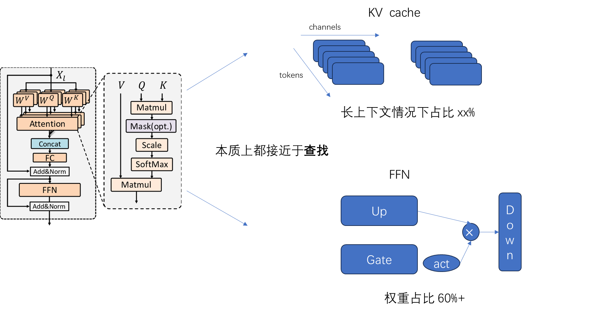

> Attention是时空力场（LLM只有时，Version存在空间力场），而FFN则是空间结构，并且代表了基于Knowledge的静态高纬字典，也有人用图书馆来比喻。   

首先回顾一下transformer block的结构，Attention +FFN，前者中的 kvcache 随着序列的增长占用越来越高，FFN则在权重中占了极大比例。
- #Attention 部分完成的是时间序列建模，完成的**当前token与历史信息（kv cache）**的相关性查找。
- #FFN 层则沉淀了训练集中的固化的“知识”，从Gate、Up的运算来看，其计算也有很强的查找属性。FFN权重的尺寸占比比较高，从直觉上讲计算中也是一部分发挥作用，这中间存在一个筛选的机制。从计算过程也可以反映出，Up、Gate的计算接近于查找得到一个mask，Down部分对应value，最终得到结果传递给下一层。

既然是查找过程，就存在选择，也就有了稀疏性。有了稀疏性指引，那很多工作就可以优化了。
比如：Attention部分kvcache 走以查代算、DRAM到GPU HBM的动态加卸载等等

