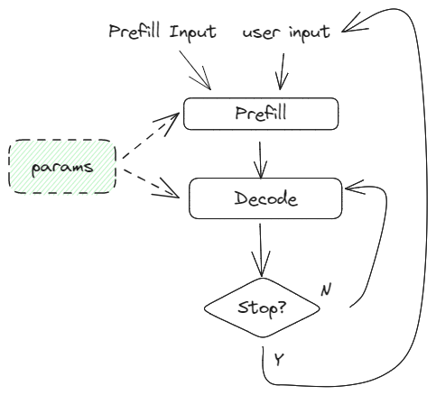

LLM 等GPT大模型大火以后,TVM社区推出了自己的部署方案，支持Llama，Vicuna，Dolly等模型在iOS、Android、GPU、浏览器等平台上部署运行。

https://github.com/mlc-ai/mlc-llm

本文在之前作者介绍的基础上,简要介绍一下mlc的调优部署方案。

## pipeline

在正式介绍TVM mlc.ai部署LLM方案之前，首先简要介绍一下当前主流LLM的一个工作流程。

>需要说明一点的是，上图中的prefill跟Decode指的的同一个模型，只是输入的shape存在差异。

这里的示意图省略了很多，只是大致描述一下pipeline。
在处理用户输入时，此时长度大小是不能确定的，这时候是完全的是一个完全的动态shape的。但在decode过程中由于是token by token的，这时候网络中的中除了kv cache相关几个部分，其他大多数的操作都是固定shape的，就可以用已有的算法调优了。

## MLC.AI 部署调优方案
以下以RedPajama3B模型的tuning跟build过程介绍一下mlc的方案。

### pipeline 组成
在已经支持的几个模型里面均有`get_model` 这个函数，在这个函数里面会创建下面4个IRModel。
- encoding_func
- decoding_func
- create_kv_cache_func
- create_softmax_func
- create_metadata_func

**encoding_func**
这对应了上图中的prefill过程，在每次用户输入后调用。由于用户输入的不确定性，所以这个过程基本上都是动态shape的，很难确定到底输入是多大，也不适合搜索调优。

**decoding_func**
这是上图中decode过程的一部分，因为这个过程是token by token的，在计算过程中大部分的计算是固定shape的。

**create kv cache func**
这里是直接调用的`relax.vm`中的函数，创建的是kv cache的存储相关。

**create softmax func**
这个也是解码过程的一部分，确切的说是采样过程中计算的一部分

** create_metadata_func **
模型的meta信息，比如`model_name`、`stop_tokens`等

### 部署优化
构建完以后，就进入到优化的阶段了。下面根据build.py过程描述一下过程。
1. API构图构建了相关的模型，读取权重
2. 量化
3. 优化PASS
	1.  FuseTransposeMatmul
	2. FuseDecodeMatmulEwise
	3. DeadCodeElimination
	4. LiftTransformParams
	5. split_transform_deploy_mod
	
4. Codegen 生成代码
	1. DispatchTIROperatorAdreno/DispatchTIROperator/DefaultGPUSchedule 手动优化的sch
	2. MetaScheduleApplyDatabase搜索的log生成固定shape的sch

### Tuning
在MLC-LLM的代码仓里面已经提供了tuning的脚本，有一点需要先做一下，先调用build.py的文件，把静态shape的相关的函数分离出来。就得到了tuning文件中需要的`mod_tir_static.py`
