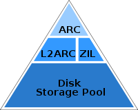

本文转载自：https://www.owlfox.org/blog/2019-11-25-coding-for-SSD-part-1/

## 缘由
Emmanuel Goossaert 是booking.com的工程师，他因为想拿SSD 做自己的 key-value store专案的储存方案，开始学习SSD 相关知识。这六篇文是他在2014 年写下，里面很多的参考资讯可能都找不到了，但是我刚好在准备SSD 相关工作面试，想想还是有参考价值，所以做了简单翻译，跟一些笔记，再加一些(个人意见)。

## 结论
作者对这系列文章的结论可以看

## 我的结论
我自己是觉得这系列文章对于入门了解SSD 还不错。如果要做到这种程度的最佳化必须要很多人一起投入。

1. sysadmin 必须确认档案系统、SSD 型号、作业系统配置。
2. developer 应用层的程式必须要注意错误的写入/读取的资料大小/频率可能对SSD 造成的过大压力。

**难维护。**

就目前我的认知，需要做到对效能斤斤计较又很重要的系统瓶颈在File system，需要对SSD 特性客制化应用层程式的机会很小。 解决方案？选个好文件系统？

## 文件系统
zfs既有的档案系统阶层在效能上可能已经很优秀了，还送copy-on-write，容错机制，snapshot。

 http://www.brendangregg.com/blog/2008-07-22/zfs-l2arc.html

zfs 也开始可以在linux 上面使用，Ubuntu 19.10 也有直接把zfs 装成roo FS 的选项。 如果是一般server、文书、游戏使用我会以后装个zfs 就好了。

至于更高端的选择.. 可能是建cepf cluster，或是open-channel SSD 等特殊解法？
