# 登录过程分析

先来到知乎提供二维码登陆的界面，利用F12开发工具，可查看请求这个二维码图片需要那些数据。

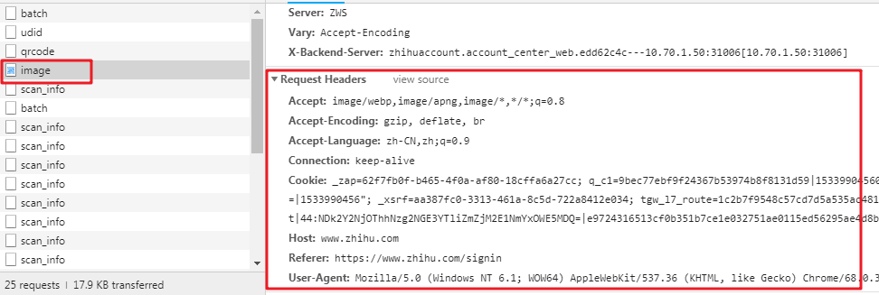
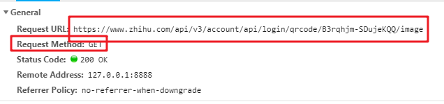

能看到是get请求，headers也很寻常，但多次刷新可发现请求的url地址有一部分在改变。寻找前面的文件，能找到这部分动态改变的值 
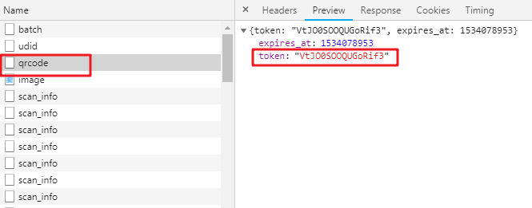

为了方便阐述，那就把image称为A文件，qrcode称为B文件。

这里就有了一个思路，先请求B文件，拿到token值以后，拼接成目的url，再去请求A文件

## 问题1

于是我们从A迁移到了B
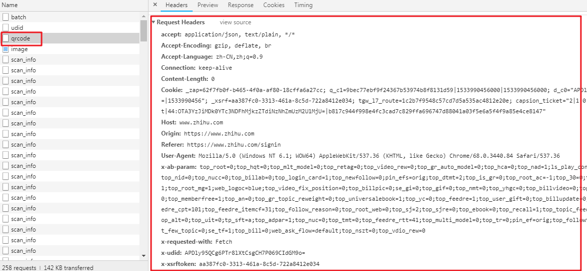

可见请求B文件的时候，headers字段是真的很多，但绝对不会所有都必要，这只能排除法了

首先看清楚了，是**POST**请求
 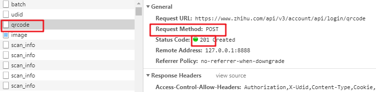

复制了所有headers，做一次post的请求，再看看状态码是不是201

> （为了避免请求被重定向，建议打印请求内容，或者关闭重定向，后面皆以打印内充处理不再单独提示）

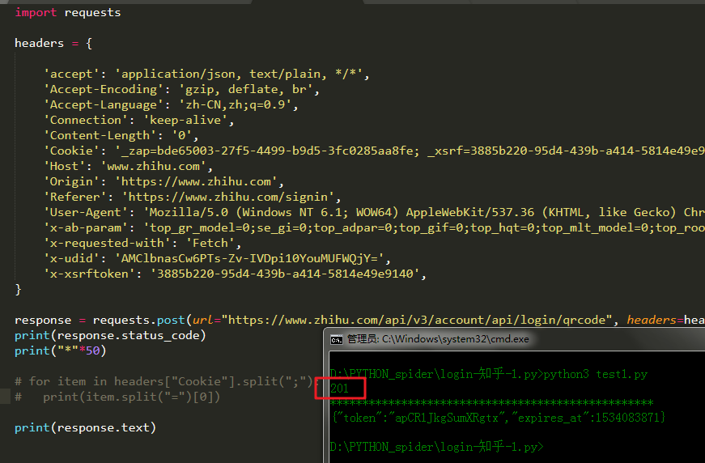

可以说很OK，然后就开始排除法，首先去掉的是最常用不到的。通过几轮排除下来，发现Cookie和User-Agent是必要的，既然需要用到cookie，我们就得维持会话，所以要实例化一个session对象了，实现如下： 

```python 
session = requests.session()
```

顺便也把Cookie分解了，看看需要哪些内容

```python
for item in headers["Cookie"].split(";"):
    print(item.split("=")[0])
```

 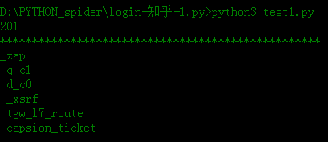

## 问题2
那么如何让session对象持有完整的cookie呢？
 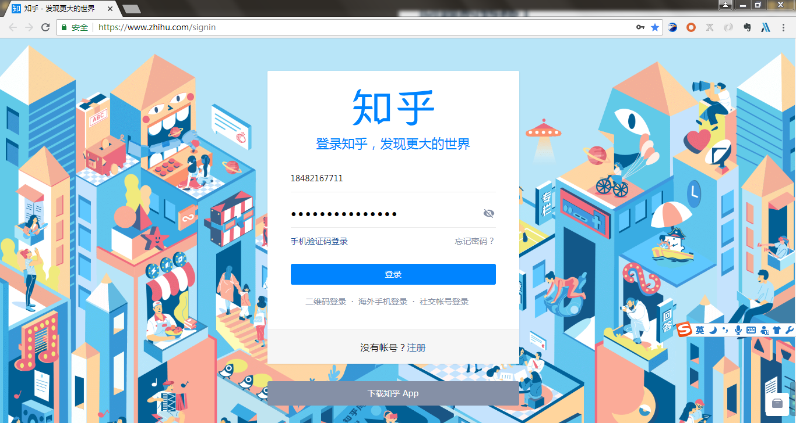

打开开发者工具，刷新页面，然后点击二维码登陆
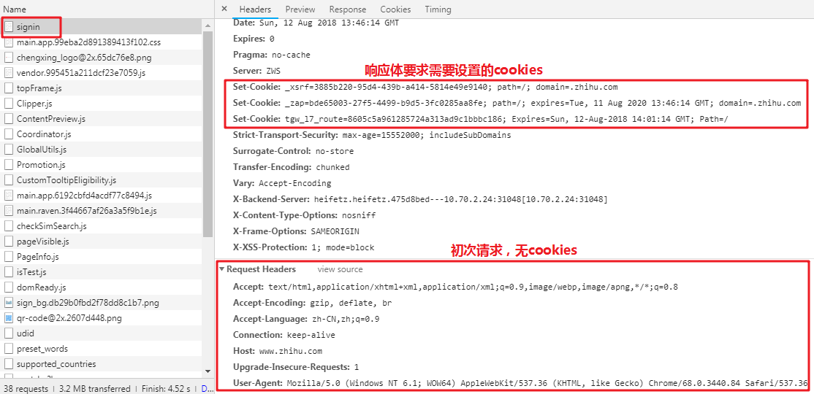

我们可以看到第一次请求登陆界面的时候，请求是不带cookies的；而请求之后，按照响应体的要求，会设置对应的`xsrf`，`_zap`，`tgw_17`。前面我们知道需要6个，这里才三个肯定是不够的，所以继续找signin后面的文件，看看到底有什么猫腻在里头

于是在`udid`这个文件中，你会发现响应体要求设置`q_c1`，`d_c0`；也就是说，在成功请求这个文件之后，Cookie就包含这两个部分了 
 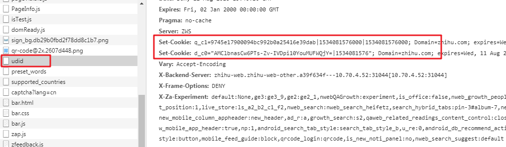


照例复制下完整的headers，找到请求的url，以及请求方式（注意了！这里也是post），最后排除法，找到必要的部分

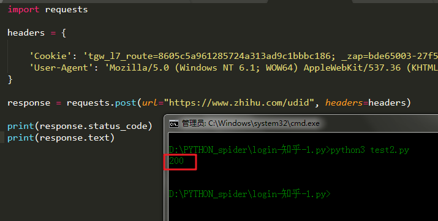

仍然是Cookie以及User-Agent

## 问题 3 
还不够，现在我们的cookies还差`capsion_ticket`部分，所以继续撸

于是找到了`captcha?lang=cn`文件，它的响应体告诉浏览器，可以设置`capsion_ticket`了 
 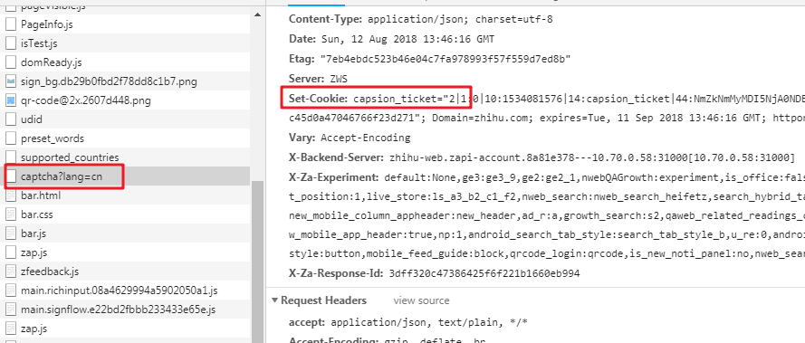


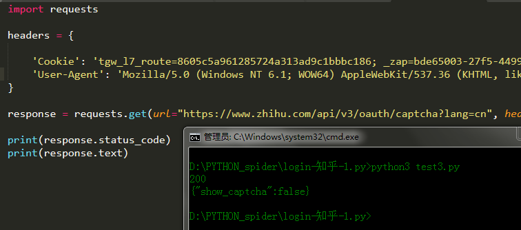

## 开始代码
有了这波分析，我们就可以开始动手敲代码了


```python
import requests
session = requests.session()

HEADERS = {
    'User-Agent': 'Mozilla/5.0 (Windows NT 6.1; WOW64) AppleWebKit/537.36 \ (KHTML, like Gecko) Chrome/68.0.3440.84 Safari/537.36'
}

# 第一次请求，为了Cookie(_xsrf，_zap，tgw_17)
session.get(url="https://www.zhihu.com/signin", headers=HEADERS)
# 第二次请求，为了Cookie(q_c1，d_c0)
session.post(url="https://www.zhihu.com/udid", headers=HEADERS)
# 第三次请求，为了Cookie(capsion_ticket)
session.get(url="https://www.zhihu.com/api/v3/oauth/captcha?lang=cn", headers=HEADERS)
# 第四次请求，为了token，用于构建二维码图片的请求链接
response = session.post(url="https://www.zhihu.com/api/v3/account/api/login/qrcode", headers=HEADERS)
# print(response.json())

# 第五次请求，为了二维码图片
url4QR = "https://www.zhihu.com/api/v3/account/api/login/qrcode/{0}/image".format(response.json().get("token"))

response = session.get(url=url4QR, headers=HEADERS)
if response.status_code == 200:
    with open("qr.jpg", "wb") as file:
        file.write(response.content)
    print("【保存二维码成功】")
else:
    print("【请求二维码图片错误】")
```

运行结果如下 
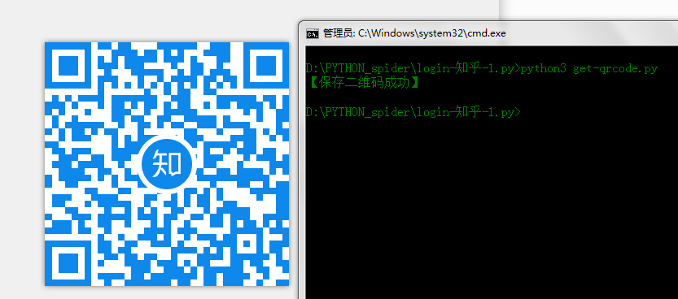

这时候以为扫描二维码就登陆成功了吗？然而没有 
 我们扫描一下网页的二维码登陆一下试试，会发现在手机上点击确认登陆以后，请求知乎www.zhihu.com网页的时候，Cookie又多了一个`z_c0 `
 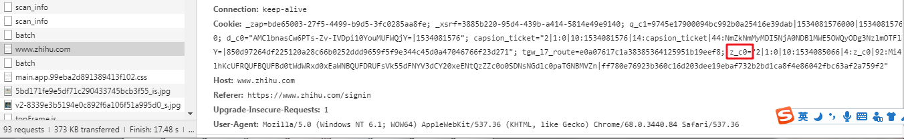
晕！但是扶住墙，老规矩。可以看到距离知乎首页文件最近的一个`scan_info`文件，说了要设置`z_c0 `
 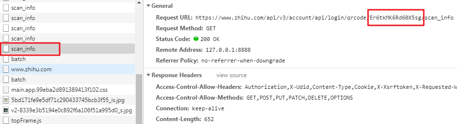

于是在我们扫描二维码之后，应该先请求这个文件，再请求首页文件；查看请求的url，也能发现，这个文件也有一部分是动态的，而且正是之前获取的token 
 

为了确保我们成功登陆，可测试编辑页面，因为这个页面只有在登陆成功后可以访问，不然就会被重定向到登陆页面去 
 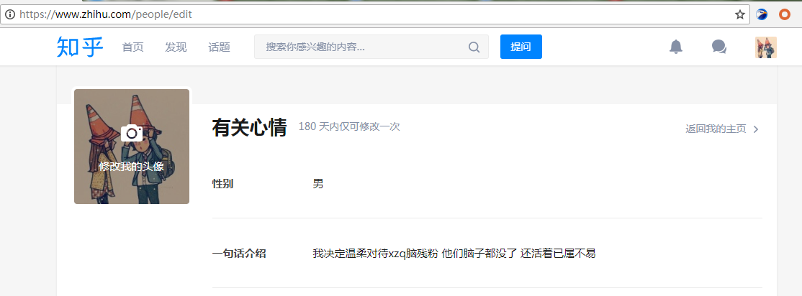

添加代码如下
```python
# 阻塞程序，给予用户扫描二维码的时间
input("请随便输入后回车")

# 请求scan_info文件，并打印状态码
print(session.get("https://www.zhihu.com/api/v3/account/api/login/qrcode/{0}/scan_info".format(token), headers=HEADERS).status_code)

# 请求编辑页面
response = session.get("https://www.zhihu.com/people/edit", headers=HEADERS, allow_redirects=False)
if response.status_code == 200:
    print("登陆成功")

    print(response.text[:10000])
```


成功
