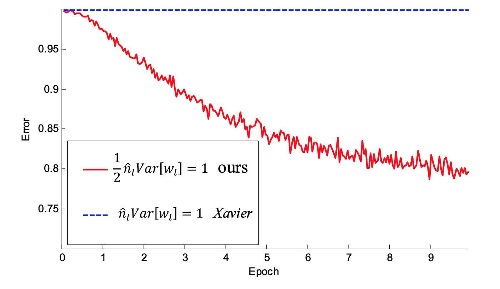

### 为什么需要初始化

初始化的原因，

- 防止每一层的输出太大或者太小，导致梯度反向传播过程中，梯度爆炸或者梯度消失。
- 不能采用统一值得原因，因为统一值得初始化会使得每一层网络在不同通道学到得特征相同。

上述原因都会导致，网络模型不能收敛。

#### 简单例子得说明

假如我们有一个输入`x` ，定义为

```python
>>> x = torch.randn(512)
```

`x`是`均值为 $0$，方差是 $1$ 的高斯分布。然后定义一个100层的神经网络（注：不包含激活函数）

```python
for i in range(100):
    a = torch.randn(512,512)
    x = a @ x
print(x.mean(), x.std())
```

那么得到

```python
(tensor(nan),tensor(nan))
```

输出已经是无穷大了。通过下面的代码，可以知道大概29层以后，输出就已经无法计算了

```python
for i in range(100):
    a = torch.randn(512,512)
    x = a @ x
    if torch.isnan(x.std()):
        break
print(i) # 28
```

既然输出太大，我们把神经网络的初始化变小一点。

```python
for i in range(100):
    a = torch.randn(512,512)*0.01
    x = a @ x
print(x.mean(), x.std())
# 0, 0
```

那么得到

```python
(tensor(0.),tensor(0.))
```

这时候的输出就太小，没办法计算了。

### 怎么找到合适的初始化方法

对于神经网络来说，前向传播过程就是矩阵运算，假设一层的输出为$y$
$$
y_i= \sum_{k=1}^{n-1}a_{i,k}x_k
$$

$i$ 是矩阵 $\mathbf{m}$ 的行，$k$ 是矩阵 $\mathbf{m}$ 的列。python的计算代码
```python
y[i] = sum([c*d for c,d in zip(a[i], x)])
```

可以证明，在给定的层，从标准正态分布初始化的输入$x$ 和权重矩阵 $a$ 的矩阵乘积平均具有非常接近输入**连接数的平方根的标准偏差**，在例子中是$\sqrt{512}$。

```python
mean,var=0.,0.
for i in range(10000):
    x = torch.randn(512)
    a = torch.randn(512,512)
    y = a @ x
    mean += y.mean().item()
    var += y.pow(2).mean().item()
print(mean()/10000, math.sqrt(var/10000))
#0.00889449315816164  22.629779825053976
print(math.sqrt(512))
# 22.627416997969522

mean,var = 0.,0.
for i in range(10000):
    x = torch.randn(512)
    a = torch.randn(512,512)
    b = torch.randn(512,512)
    y = a @ x
    z = b @ y
    mean += z.mean().item()
    var += z.pow(2).mean().item()
print(mean/10000, math.sqrt(var/10000))
#0.6010947234869003 511.8684602024235
```

如果我们根据如何定义矩阵乘法来看前向传播的过程：

为了计算 $y$，我们将输入 $x$ 的一个元素的乘以矩阵 $\mathbf{a}$ 的一列的512个乘积然后相加。在使用标准正态分布初始化$x$ 和 $a$ 的示例中，这$512$ 个数字中的每一个的平均值为 $0$，标准差为$1$。

> **经过一层网络运算以后，均值没变，方差扩大了$\sqrt{512}$倍。**

因此在初始化的是，缩小$\sqrt{512}$倍，那么输出结果就能保证不**爆炸**了。

```python
mean,var=0.,0.
for i in range(10000):
    x = torch.randn(512)
    a = torch.randn(512,512)/math.sqrt(512)
    y = a @ x
    mean += y.mean().item()
    var += y.pow(2).mean().item()
print(mean/10000, math.sqrt(var/10000))
#0.00039810733370250094 1.0007971983717594

```

```python
x = torch.randn(512)
for i in range(100):
    a = torch.randn(512,512)/math.sqrt(512)
    x = a @ x
print(x.mean(), x.std())
#tensor(-0.0048) tensor(1.2810)
```

### Xavier Initialization

上面介绍的情况是在不含有激活的函数情形，如果增加了激活函数，是否仍能保持不变呢？对于不同类型的激活函数，是不是有不同的表现呢？最开始用的激活函数多数为对称的，并且导数从中间到两边有递减为0。比如，常用的`tanh`和`sigmoid`函数。

下面的结果是在上面的例子中分别增加了，`tanh`和`sigmoid`函数的结果。

```python
#sigmoid
x = torch.randn(512)
for i in range(100):
    a = torch.randn(512,512)/math.sqrt(512)
    x = torch.sigmoid( a @ x)
print(x.mean(), x.std())
#tensor(0.5057) tensor(0.1180)
```

```python
#tanh
x = torch.randn(512)
for i in range(100):
    a = torch.randn(512,512)/math.sqrt(512)
    x =  torch.tanh( a @ x)
print(x.mean(), x.std())
#tensor(-0.0051) tensor(0.0879)
```

可以看到经过激活函数以后，函数方差明显变小了。在训练过程中这就会导致，导致梯度过小，使得训练难以进行。

上面用的是正态分布，如果采用均匀分布呢？

```python
x = torch.randn(512)
for i in range(100):
    a = torch.Tensor(512,512).uniform_(-1,1)/math.sqrt(512)
    x =  torch.tanh( a @ x)
print(x.mean(), x.std())
#tensor(-3.8077e-26) tensor(1.2476e-24)
```

```python
x = torch.randn(512)
for i in range(100):
    a = torch.Tensor(512,512).uniform_(0,1)/math.sqrt(512)
    x =  torch.tanh( a @ x)
print(x.mean(), x.std())
#tensor(-1.) tensor(0.)
```

```python
x = torch.randn(512)
for i in range(100):
    a = torch.Tensor(512,512).uniform_(0,1)/math.sqrt(512)
    x =  torch.sigmoid( a @ x)
print(x.mean(), x.std())
#tensor(1.0000) tensor(3.8114e-06)
```

```python
x = torch.randn(512)
for i in range(100):
    a = torch.Tensor(512,512).uniform_(-1,1)/math.sqrt(512)
    x =  torch.sigmoid( a @ x)
print(x.mean(), x.std())
#tensor(0.4934) tensor(0.0659)
```

方差都出人意料的小。这就几乎不能学习到什么有用的特征了。

为此，Glorot and Bengio 提出了`Xavier initialization`的初始化方式

#### 定义

这种初始化方式是从随机均匀分布初始化神经网络的，均匀分布的范围是
$$
\pm \frac{\sqrt{6}}{\sqrt{n_i+n_{i+1}}}
$$
这里的 $n_i$ 是输入神经元数目，$n_{i+1}$ 是输出神经元数目。

Glorot and Bengio 认为Xavier 初始化方法，可以在包含激活函数的神经网络中保持方差的变化很小。


除此之外，同样证明了，传统方法在底层网络方差大，高层网络方差趋近于0的现象。


```python
def xavier(m,n):
    return torch.Tensor(m,n).uniform_(-1,1)/math.sqrt(6./(m+n))

x = torch.randn(512)
for i in range(100):
    a = xavier(512,512)
    x =  torch.tanh( a @ x)
print(x.mean(), x.std())
#tensor(0.0854) tensor(0.9933)
x = torch.randn(512)
for i in range(100):
    a = xavier(512,512)
    x =  torch.sigmoid( a @ x)
print(x.mean(), x.std())
#tensor(0.4686) tensor(0.4976)
```

### Kaiming Initialization

进来CV领域中，激活方法多是采用`Relu` 函数。对于这个函数。之前的初始化方法，又有哪些不一样？

```python
x = torch.randn(512)
for i in range(100):
    a = torch.randn(512,512)/math.sqrt(512)
    x = torch.relu(a @ x)
print(x.mean(), x.std())
# tensor(4.6656e-16) tensor(6.7154e-16)
```

```python
x = torch.randn(512)
for i in range(100):
    a = xavier(512,512)
    x =  torch.relu( a @ x)
print(x.mean(), x.std())
# tensor(nan) tensor(nan)
```

之前的初始化方法，对于`Relu`函数都不奏效了。那对于每一层来说，有什么变化

```python
mean,var=0.,0.
for i in range(10000):
    x = torch.randn(512)
    a = torch.randn(512,512)/math.sqrt(512)
    y = torch.relu(a @ x)
    mean += y.mean().item()
    var += y.pow(2).mean().item()

print(mean/10000, math.sqrt(var/10000))
#9.01142036409378 15.991211348807246
print(math.sqrt(512/2))
#16.0
```

可以看到，这时候的输出跟输入网络层数大小是有关系的。在下面的实验验证以下。

```python
mean,var=0.,0.
for i in range(10000):
    x = torch.randn(512)
    a = torch.randn(512,512)/math.sqrt(512/2.)
    y = torch.relu(a @ x)
    mean += y.mean().item()
    var += y.pow(2).mean().item()

print(mean/10000, math.sqrt(var/10000))
#0.5640919140070677 1.0003173674661943
```

```python
def kaiming(m,n):
    return torch.randn(m,n)*math.sqrt(2./m)

x = torch.randn(512)
for i in range(100):
    a = kaiming(512,512)
    x = torch.relu( a @ x)
print(x.mean(), x.std())
# tensor(0.8135) tensor(1.2431)
```

对照本部分开始的结果`kaiming`方法在对于`Relu`函数更有优势。

下图给出了两种方法在一个30层CNN上的结果。



---

**来源**  [Weight Initialization in Neural Networks: A Journey From the Basics to Kaiming](https://towardsdatascience.com/weight-initialization-in-neural-networks-a-journey-from-the-basics-to-kaiming-954fb9b47c79)
